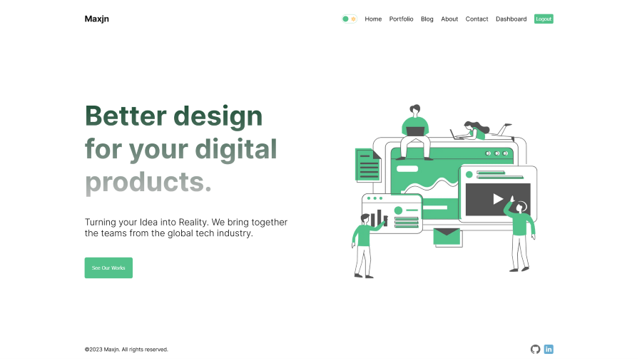

# Portfolio Blog - Nextjs v13.4.1

This is a basic practical crud [Next.js](https://nextjs.org/) project bootstrapped with [`create-next-app`](https://github.com/vercel/next.js/tree/canary/packages/create-next-app).

It's a serverless crud app with authentication and other features, explore the [demo](https://maxjn-portfolio-blog.vercel.app/) for better understanding'.
You can signin using Google or Giyhub and Write, Edit, Delete your posts.

## Technologies

- TSX, Css,
- TypeScript
- **Nextjs v13.4.1**
- **Packages:** mongodb, mongoose, next-auth, react-icons, date-fns
- **Routing:** useing new app directory

## Features

- Authentication
- Adding prompt
- deleting prompt
- updating prompt
- getting prompt
- filter

## Installation

###### Add Environment Variables

Create **.env.local** from '.env.example' file and declare the project environment variables

Install **Portfolio-Blog** using npm

###### shell command

```shell
npm install

npm run dev
```

## Screenshots


